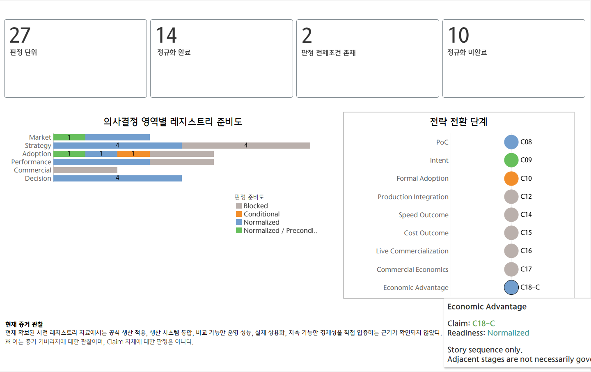
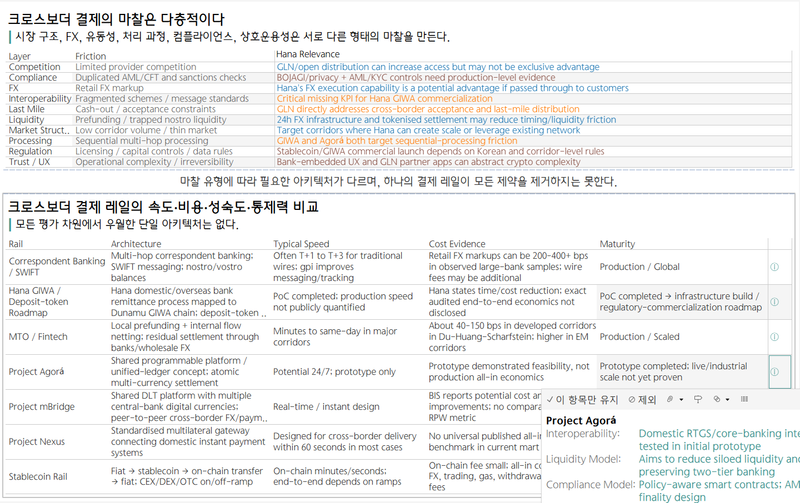
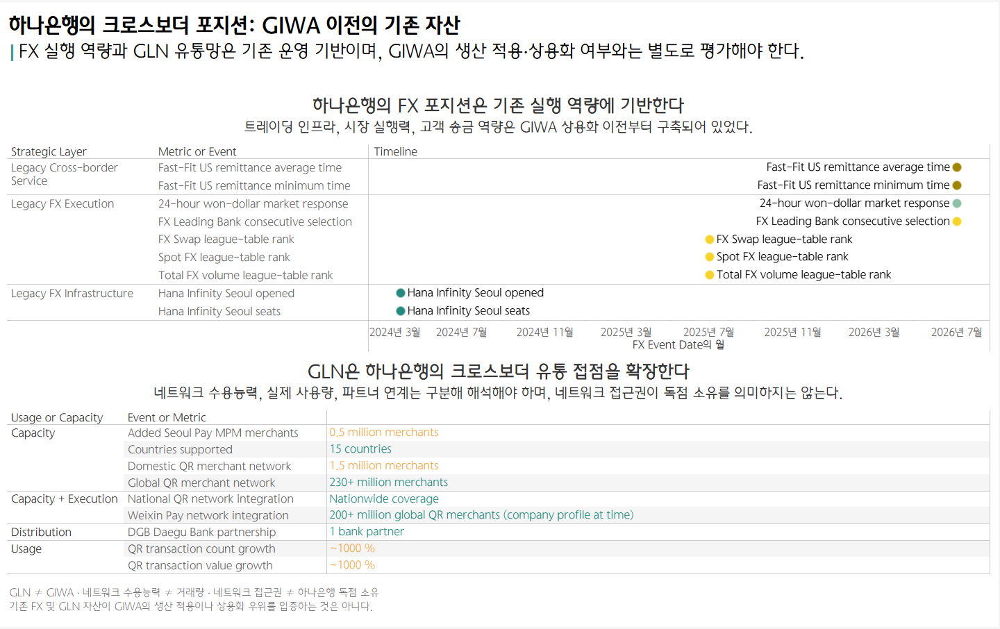
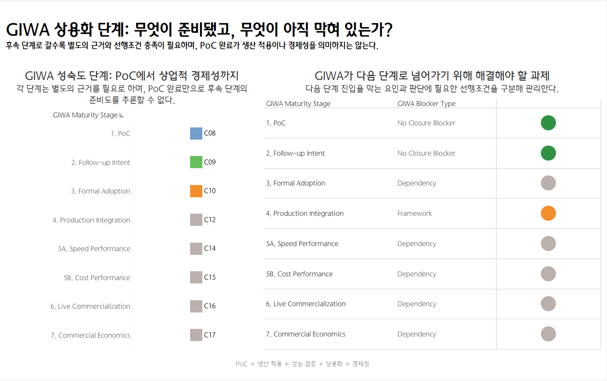
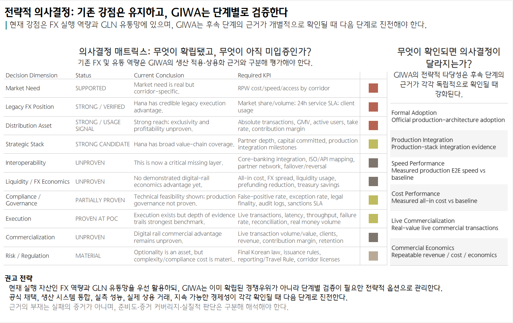

# Hana Cross-border Strategy

> 공개 데이터를 기반으로 크로스보더 결제의 구조적 마찰, 하나은행의 FX·GLN 역량, GIWA의 상용화 조건을 분석한 Tableau 프로젝트

사내 데이터 분석 경진대회 출품을 위해 수행한 프로젝트입니다.  
새로운 결제 기술을 단순 비교하기보다 **시장 문제 → 결제 레일 → 기존 역량 → GIWA 성숙도 → 의사결정**으로 이어지는 분석 프레임을 구성했습니다.


## Analysis Question

이 프로젝트는 네 가지 질문에서 출발했습니다.

- 크로스보더 결제는 왜 여전히 비싸고 느린가?
- 기존 Correspondent Banking과 새로운 Payment Rail은 어떤 차이가 있는가?
- 하나은행은 GIWA 이전부터 어떤 FX·글로벌 결제 자산을 보유하고 있었는가?
- GIWA가 PoC를 넘어 실제 상용 경쟁우위가 되려면 어떤 근거가 추가로 필요한가?

## Analysis Framework

```text
Market Friction
      ↓
Rail Benchmark
      ↓
Hana Position
      ↓
GIWA Maturity
      ↓
Strategic Decision
```

분석 전반에는 다음 가드레일을 적용했습니다.

> **PoC ≠ Production ≠ Commercialization ≠ Competitive Advantage**

기술 실증, 생산 적용, 실제 상용 거래, 경제성을 각각 별도의 검증 단계로 분리했습니다.

## Dashboards

### 01. Decision Readiness



현재 확보된 주장과 근거가 실제 판단에 사용할 수 있는 수준인지 `Normalized`, `Conditional`, `Blocked`, `Precondition`으로 구분했습니다.  
자료의 존재 여부보다 **현재 근거로 어디까지 판단할 수 있는가**에 초점을 맞췄습니다.

### 02. Cross-border Friction & Rail Benchmark



크로스보더 결제의 마찰을 Market Structure, FX, Liquidity, Processing, Compliance, Interoperability, Last Mile, Regulation 등으로 분해하고, Correspondent Banking, MTO/Fintech, Stablecoin, Nexus, Agorá, mBridge, GIWA를 구조적으로 비교했습니다.

핵심 관점은 **모든 평가 차원에서 우월한 단일 아키텍처를 가정하지 않는 것**입니다.

### 03. Hana Position



GIWA와 별개로 하나은행이 기존에 보유한 FX 실행 역량과 GLN 유통 접점을 정리했습니다.  
크로스보더 경쟁력을 신규 기술 하나의 성과로 환원하지 않고 **기존 운영 기반과 신규 디지털 레일을 분리**해서 평가했습니다.

### 04. GIWA Maturity



GIWA의 진행 단계를 `PoC → Follow-up Intent → Formal Adoption → Production Integration → Performance Validation → Live Commercialization → Commercial Economics`로 나눴습니다.

각 단계는 자동으로 다음 단계의 성공을 의미하지 않으며 별도의 근거가 필요합니다.

### 05. Strategic Decision



최종 화면에서는 기존 FX·GLN 역량과 GIWA의 미검증 영역을 함께 놓고, 어떤 추가 근거가 확보될 때 다음 판단 단계로 이동할 수 있는지를 정리했습니다.

공개자료 기준으로 확인 가능한 기존 자산과 아직 검증이 필요한 디지털 레일 영역을 구분하는 것이 핵심입니다.

## Methodology

분석에서는 다음 원칙을 유지했습니다.

1. **PoC와 Production을 구분** — 기술 실증을 실제 생산 적용과 동일하게 취급하지 않았습니다.
2. **Production과 Commercialization을 구분** — 시스템 통합과 실제 유료·상용 거래를 별도로 확인했습니다.
3. **GLN과 GIWA를 분리** — 운영 중인 유통 네트워크와 신규 디지털 레일 후보를 혼동하지 않았습니다.
4. **비동질 지표를 직접 랭킹하지 않음** — 비용·속도·성숙도의 정의와 측정 기준이 다른 경우 단순 종합점수화를 피했습니다.
5. **근거의 부재와 실패를 구분** — 공개 근거가 확인되지 않는다는 사실을 실패의 증거로 해석하지 않았습니다.

세부 방법론은 [`docs/methodology.md`](docs/methodology.md)에서 확인할 수 있습니다.

## Data Sources

회사 내부 데이터는 사용하지 않았으며, 공개 데이터와 공개 공시·IR·연구자료를 기반으로 분석했습니다.

주요 출처는 다음과 같습니다.

- World Bank — Remittance Prices Worldwide
- Financial Stability Board — Cross-border Payments KPI / G20 Targets
- IMF / BIS / South African Reserve Bank 등 연구·정책 자료
- Project Agorá / mBridge / Nexus 관련 공개자료
- 하나금융그룹·하나은행 IR 및 공시
- GLN 및 GIWA 관련 공개자료
- KB·신한·우리 등 국내 금융그룹의 공개 공시·IR 자료

자료별 기간, 출처, 링크, Tableau 활용 목적은 [`docs/data_sources.md`](docs/data_sources.md)에 정리했습니다.

## Repository Structure

```text
.
├── README.md
├── PACKAGE_MANIFEST.md
├── assets/
│   └── dashboard_overview.png
├── dashboard/
│   ├── hana_crossborder_strategy.twb
│   ├── hana_crossborder_strategy.twbx
│   └── screenshots/
│       ├── 01_decision_readiness.png
│       ├── 02_crossborder_friction_rail_benchmark.png
│       ├── 03_hana_position.png
│       ├── 04_giwa_maturity.png
│       └── 05_strategic_decision.png
├── data/
│   ├── README.md
│   └── Hana_Decision_Intelligence_Tableau_Mart_v3_KR.xlsx
├── docs/
│   ├── data_sources.md
│   ├── methodology.md
│   └── publish_checklist.md
└── presentation/
    └── hana_crossborder_strategy_overview.pptx
```

## Deliverables

- Tableau Workbook (`.twb`, `.twbx`)
- 공개 데이터 기반 Tableau Analysis Mart
- Cross-border Friction Taxonomy
- Payment Rail Benchmark
- Hana FX / GLN / GIWA 분석 레이어
- Claim / Evidence Registry 및 Decision Matrix
- 분석 개요 발표자료

## Reproducibility

- `.twbx`에는 실행에 필요한 데이터 스냅샷이 패키징되어 있습니다.
- `.twb`는 저장소의 `data/Hana_Decision_Intelligence_Tableau_Mart_v3_KR.xlsx`를 참조하도록 정리했습니다.
- 원문 PDF·웹페이지 전체는 저장소에 재배포하지 않고 출처 링크와 가공 Mart를 제공합니다.
- 데이터 및 해석은 수집 시점의 공개자료를 기준으로 합니다.

## Notes

본 저장소는 공개자료를 이용한 데이터 분석 포트폴리오입니다.  
특정 기업·기술·사업의 성공 여부를 단정하기 위한 자료가 아니라, 공개 근거를 구조화해 비교·검토한 분석 결과입니다.
